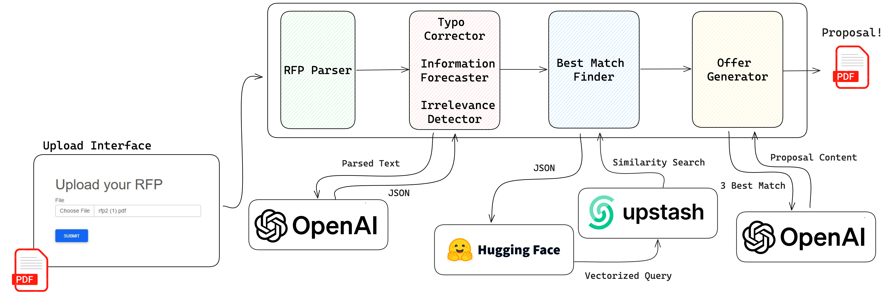

# AaltoAI-Hack
AaltoAI Hackathon, Microsoft GenAI Challenge

# AI-Assisted RFP Processing Pipeline

## Overview
In the competitive B2B sector, responding efficiently and accurately to Requests for Proposals (RFPs) is crucial for securing new contracts and investments. Our global company, which manufactures and sells a diverse range of products, is embracing Generative AI to enhance our response process to RFPs. This project aims to reduce manual labor, accelerate response times, and improve the accuracy of our proposals.

## Challenge
We are tasked with developing a Generative AI system that can:
- *Extract RFP Details*: Process RFP documents in various formats (DOCX, PDF, JPG) and extract critical information such as sender's details, RFP issue and due dates, and specific requirements (product specs, technical drawings).
- *Determine Suitable Products*: Identify the most appropriate products from our catalog that match the RFP details, considering size, dimensions, type, weight, and power requirements.
- *Craft Proposals*: Auto-populate our proposal template with the selected products, pricing, and terms of delivery.
- *Obtain Approval*: Ensure the proposal's economic feasibility based on defined metrics.
- *Return Proposal PDF*: Generate and deliver a finalized proposal in PDF format.

## Solution
To address this challenge, we have implemented an AI-powered pipeline that integrates various AI models and techniques to automate the RFP response process. The diagram below illustrates the proposed solution:

## Pipeline Stages
1. *Upload RFP*: Users can upload RFP documents directly to the system.
2. *Parse Text*: The system extracts text from the uploaded documents.
3. *Generate JSON*: Extracted text is converted into a structured JSON format.
4. *Vectorize Query*: JSON data is used to create a vectorized representation for similarity searching.
5. *Upstash*: Utilize Upstash's vector database to find similar past RFP responses.
6. *Hugging Face*: Leverage Hugging Face models for additional AI processing.
7. *Proposal Content*: Compile the content for the proposal based on the best matches.
8. *Best Match*: Determine the top 3 most suitable responses.
9. *Generate Proposal*: Populate the proposal template and create a draft.
10. *Finalize PDF*: Convert the approved proposal into a PDF document.
